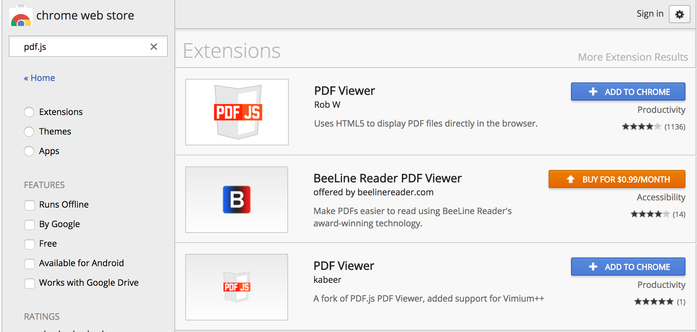
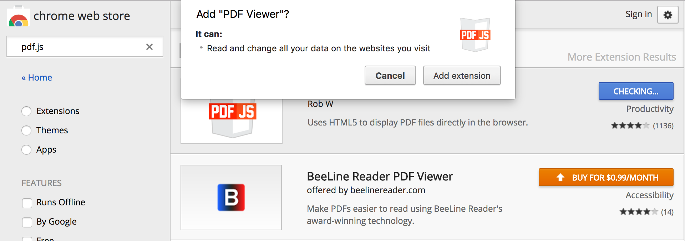
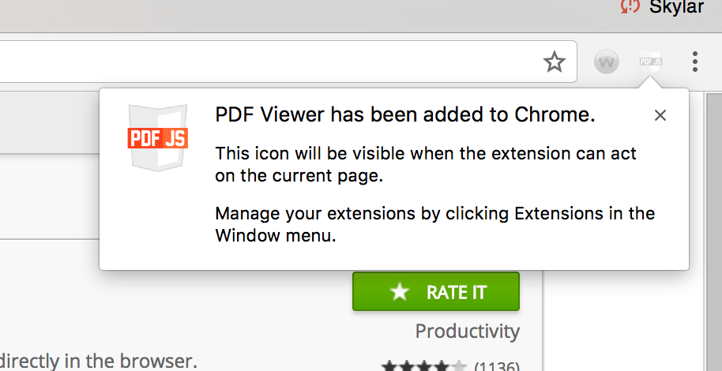

<b>
<h1 style="font-size:300%;">
Team 2: Project Outline
</h1>
<h1>
Before trying to download PDF.js as a Google Chrome Extension, make sure that you have Chrome installed on your desktop. 
</h1>
<h1>
Step One: Access the Google Chrome Web Store and search for "PDF.js" in the search bar. 
</h1>
<h1>

</h1>
<h1>
Step Two: Click “+Add to Chrome”
</h1>
 
<h1>
Step Three: Grant access to PDF.js through Chrome Extension
</h1>

