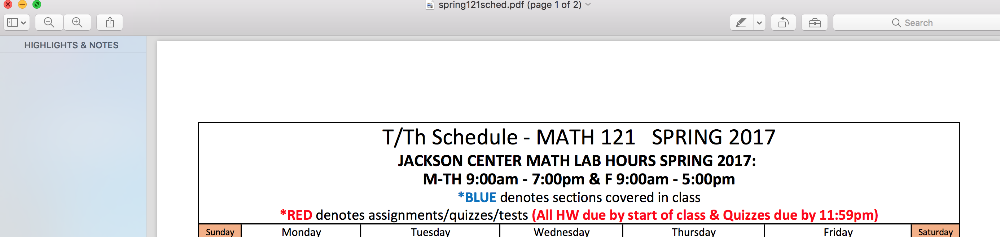
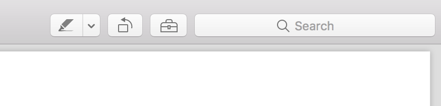
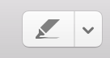
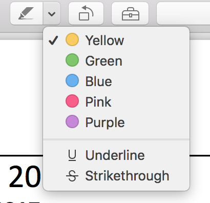
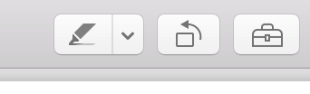
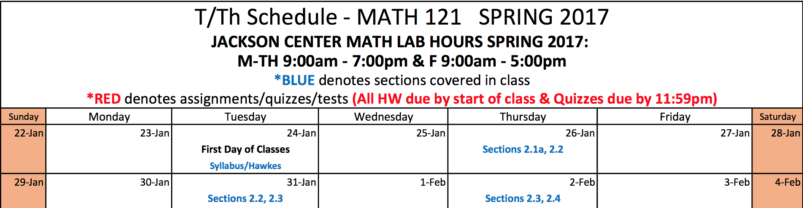
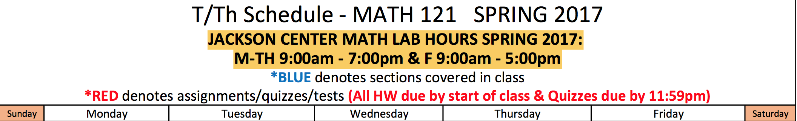
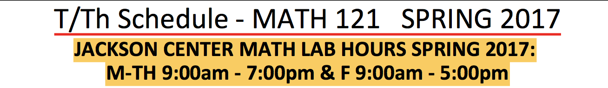

<h1>
 How to Annotate A PDF on PDF.js
 </h1>
 
 <h1>
 Step One: This is the top of your PDF.js reader. Each of the three buttons on the top right hand corner of your page gives you the ability to annotate your document. 
 </h1>
 
  
 
 <h1>
 These are your annotation buttons
 </h1>
 
 
 
 
 <h1> We will specifically be looking at this button
 </h1>
 
 
 
 <h1>
 Click on this button for the drop down menu
 </h1>
 
 
 

           
       
                      

