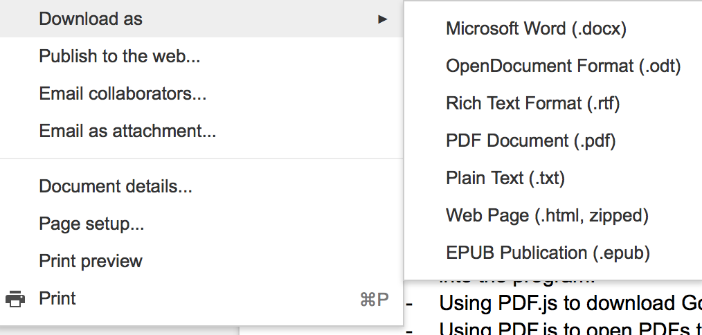
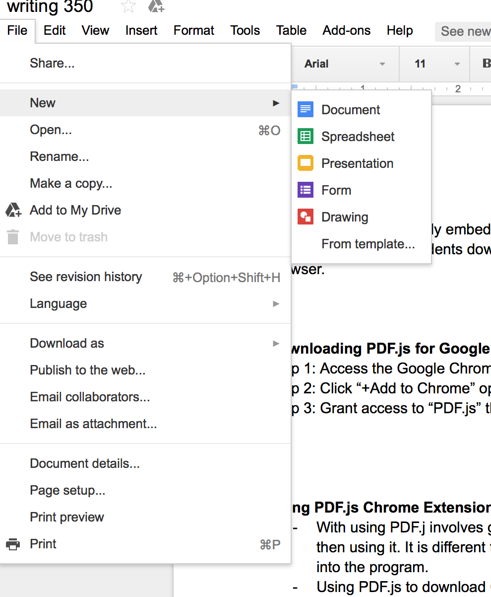

<b>
<h1>
Team 2: Using PDF.js to Convert a Google Doc into a PDF file
</h1>

<h1>

Step One:  Log into your Google account. Go to your Google Doc and go to "File". 

</h1>

<h1>
<u>
Step Two: </u> Tab down from the "File" folder until you reach "Download As"
</h1> 

</b>

<h1>
Step Two: 
</h1>

<h1>
Step Three: Select the option "PDF"
</h1>

<h1>
Step Three: 
</h1>

