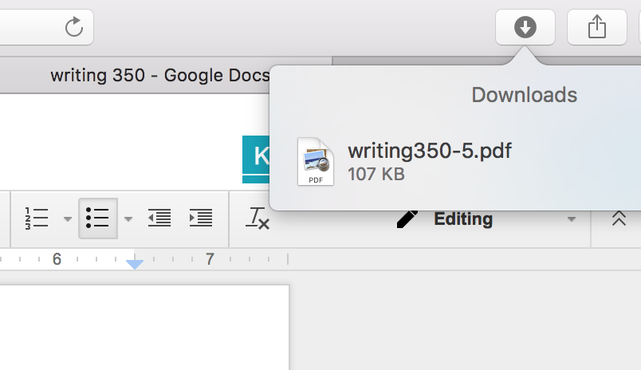

<h1 style="font-size:300%;">
Team 2: How to Open PDFs on PDF.js from Gmail
</h1>

<h1>
Step One: Open your email, if PDF is attached, click on the "Down Arrow" button when your cursor is hovering over attachment. 
</h1> 

 

<h1> The file will be moved to your downloads, typically at the top of your web browser with a "Down Arrow" button. Click on this button, and PDF.js will open with your selected document. 
<h1>

